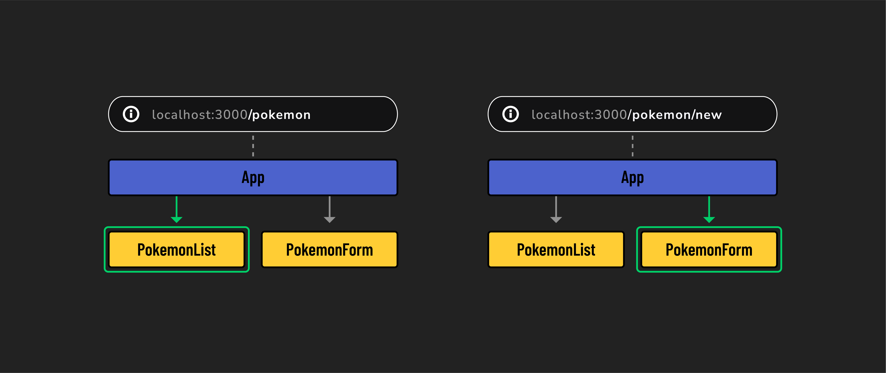

# 

**Learning objective:** By the end of this lesson, students will understand how React Router enhances single-page applications by providing dynamic navigation similar to traditional multi-page websites.

## The limitations of single-page applications

While single-page applications (SPAs) offer several improvements over traditional multi-page, server-side-rendered applications, they also present unique challenges due to their single-page nature.

Here are some examples:

- In SPAs, the entire application operates under a single URL. This means you cannot directly bookmark internal pages or states of the application. You can bookmark the main page, but navigating back to a specific internal state would require additional steps each time.
- Similarly, sharing specific parts of the application with others can be challenging because the entire SPA resides under one URL. To direct someone to a particular section, you would need to provide instructions on navigating there from the main page.
- Traditional anchor tags `<a>` are ineffective for navigating between different sections within the SPA, as all navigation would need to handle changing states rather than switching pages.

To overcome these limitations, React developers often use third-party libraries designed to enable SPA navigation that mimics the behavior of multi-page websites.

## What is React Router?

[React Router](https://reactrouter.com/en/main/router-components/browser-router) is a library that enables *client-side routing* in React applications. With React Router, users can experience all of the benefits of a SPA, along with the expected navigational aspects of traditional websites.

React Router allows SPAs to mimic the functionality of multi-page websites. It accomplishes this through conditional rendering. Whenever React Router detects a change in the URL, it can render corresponding components accordingly. As a result, different content and layouts can be displayed as if they were separate pages, without the need for page reloads. 

Some key features of React Router include:

- **Navigation**: Enables easy navigation between different parts of your app, similar to browsing through pages on a conventional website.
- **Dynamic content loading**: Displays content based on the URL without needing to reload the entire page, keeping your app fast and responsive.
- **Route parameters**: Utilizes specific segments of the URL to display content.
- **Programmatic navigation**: Provides ways to change views programmatically, ideal for actions like redirecting a user after submitting a form.

> 📚 *Client-side routing* is a technique used in web development where navigation within an app is handled by JavaScript. Rather than making additional requests to the server every time a user navigates to a new page, information is conditionally rendered based on the URL.