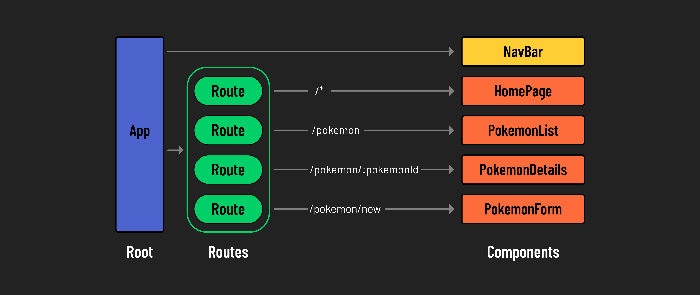

# 

**Learning objective:** By the end of this lesson, students will be able to create client-side routes with React Router.

## Implementing client-side routing with React Router

With our navigation bar in place, we can now define the content that should be rendered at each location in our app with some client-side routing. Through client-side routing, we can render different components based on the URL, mimicking the functionality of a traditional multi-page website within a single-page application.

To build out these routes, we use two components provided by React Router:

1. **`<Route>`**: Used to define individual routes within the application. Each `<Route>` specifies a `path` and an `element` to render when that path is accessed.

2. **`<Routes>`**: Acts as a _container_ for individual `<Route>` components. When a user accesses a URL, the `<Routes>` component looks through its child routes to find the best match, rendering the corresponding UI.

Below is a diagram depicting the client-side routes that we'll build out in our application:



## Defining routes

At the top of `App.jsx`, let's import `Route` and `Routes` from `react-router-dom`:

```jsx
// src/App.jsx
import { Route, Routes } from 'react-router-dom';
```

Next, we'll need to adjust the `return` statement to include the `<Routes>` component. This `<Routes>` component will contain all of the individual routes for our application.

Update the following in `App.jsx`:

```jsx
// src/App.jsx

return (
  <>
    <h1>Pokemon!</h1>
    <NavBar />
    <Routes>

    </Routes>
  </>
);
```

Currently, our navigation bar has a link directing users to `'/pokemon'`. Let's define a `<Route>` so that the `<PokemonList>` component is rendered at this path.

```jsx
// src/App.jsx

<Routes>
  <Route path="/pokemon" element={<PokemonList pokemon={pokemon} />} />
</Routes>
```

With the above `<Route>` component, we have defined a `path` as `/pokemon` and the `element` as the component `<PokemonList />` to render when that path is accessed.

Start the app up and open up your browser. Click on the 'Pokemon' link in the nav bar to navigate to `'/pokemon'`. You should see the `pokemon` data being rendered! If you navigate back to `'/'` with the 'Home' link, you might notice that only the page header and `<NavBar />` are being rendered. Let's address that issue in the next section.

## Creating a default route

To set up a default route (home page), we _could_ create a new `Homepage.jsx` component, but we can also define some JSX to render directly in the `element` prop. Let's go with the second option to better demonstrate some of the flexibility you have in building routes.

Add the following to the `<Routes>` in `App.jsx`:

```jsx
// src/App.jsx

<Routes>
  <Route path="/" element={<h2>Home Page</h2>} />
  <Route path="/pokemon" element={<PokemonList pokemon={pokemon} />} />
</Routes>
```

Try it out in your browser. Using the nav bar, try navigating between the two pages.
